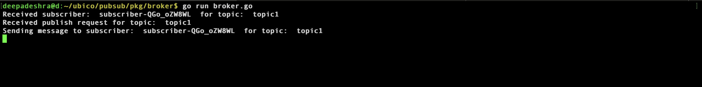
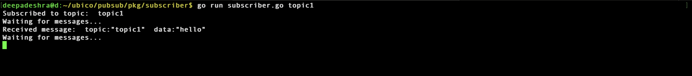

# Golang based pubsub using Grpc


## Introduction
This is a simple pubsub system using grpc. It has a publisher and a subscriber. The publisher can publish messages to a topic and the subscriber can subscribe to a topic and receive messages from the topic.

This project is a simple example of how to use grpc in golang. Its not intended to be used in production.

## Architecture

The project has 3 main components:
1. Broker : Broker is responsible to keep track of all the topics and the subscribers for each topic. It also has a method to publish messages to a topic.

2. Publisher: Publisher is responsible to publish messages to a topic. Published message go to the broker and broker sends the message to all the subscribers of the topic.

3. Subscriber: Subscriber is responsible to subscribe to a topic and receive messages from the topic. Subscriber connects with broker and receives a stream of messages from the broker.


## How to run

### start the broker
```shell
go run pkg/broker/broker.go
```

### start the subscriber
```shell
go run pkg/subscriber/subscriber.go <topic>
```

### start the publisher
```shell
go run pkg/publisher/publisher.go <topic> <message>
```

## Demo

### Broker


### Subscriber


### Publisher
